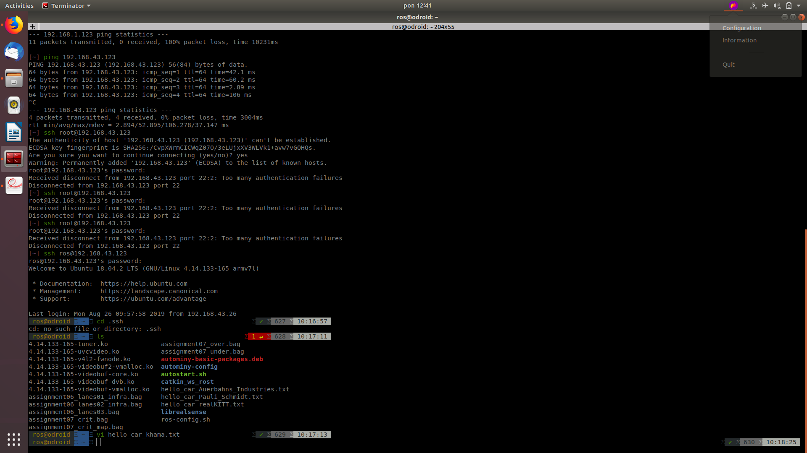
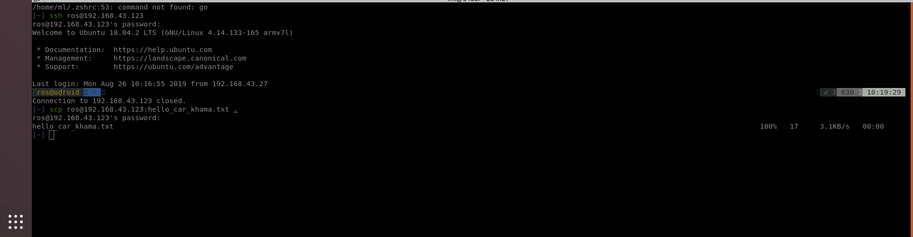
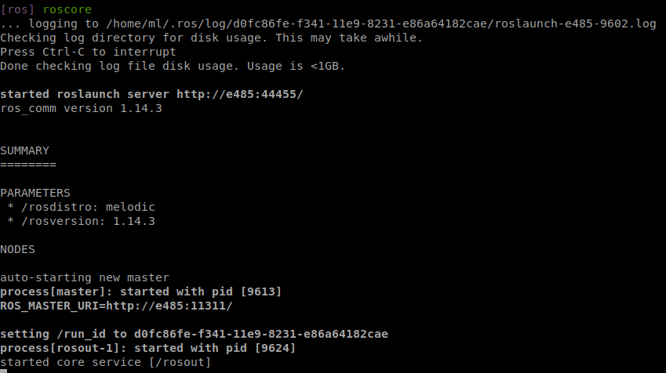
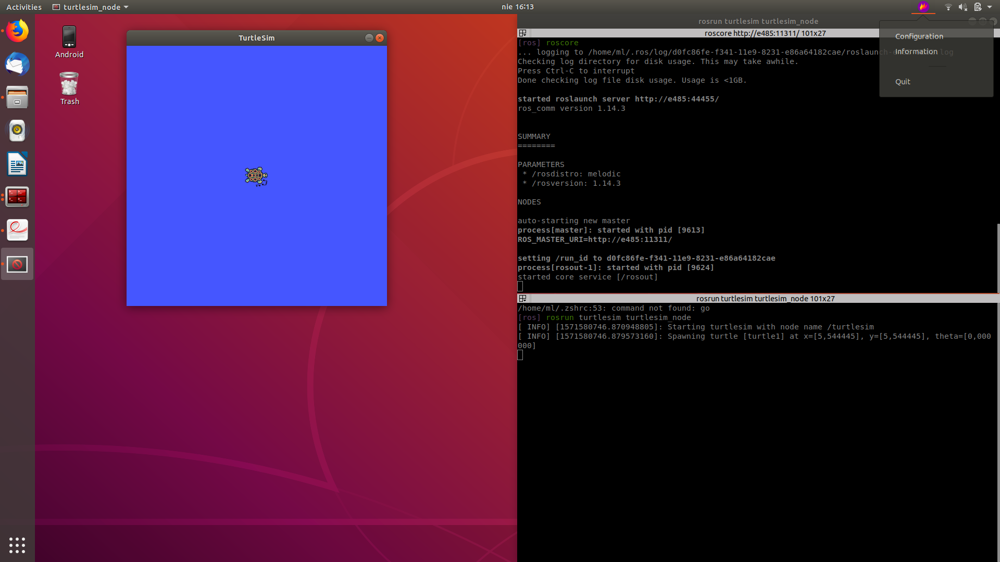

# Robotik Ü1
Khanh Bui Trong & Manuel Leppert

## Connect to the model car via SSH
ros-network: 192.168.43.*

logged in:

scp copy from robot to local:

## Create a repository
https://github.com/sherlockhomeless/catkin_ws_user

## ROS installation
    roscore:

    tutorial 5 finished:

